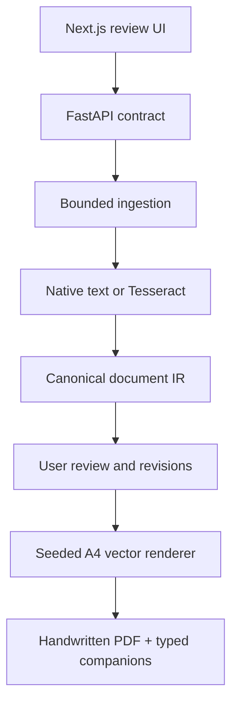

# Homeworker

Homeworker turns PDFs and document images into reviewable A4 notes rendered in a licensed handwriting persona. Version 0.2.0 is a **local-first** vertical slice (upload → extract/OCR → per-page review → confirm → A4 export). OCR is uncertain evidence, not truth.

The optional hosted profile (Cloudflare Pages / Render / Supabase Free) exists in-tree but is **not** a public-launch SLA: free dynos sleep, disks are ephemeral, and you must pass the live two-account check in `docs/free-public-deployment.md` before inviting anyone.

License: **AGPL-3.0-only** (required by PyMuPDF). Terms: [docs/terms.md](docs/terms.md). Privacy: [docs/privacy.md](docs/privacy.md).

This repository is a complete runnable vertical slice: upload -> extract/OCR -> review -> choose persona -> preview -> confirm -> export handwritten PDF and typed companions.

## What is included

- Native PDF text extraction with PyMuPDF.
- Local OCR for scanned PDFs, PNG, and JPEG through Tesseract.
- Block-level confidence, source page/region, extractor, and warnings.
- Explicit edits, immutable revisions, and optimistic concurrency protection.
- Three bundled SIL-OFL personas: Scholar, Casual, and Compact.
- Deterministic ISO A4 vector PDF output using an explicit seed.
- Visible draft watermark until the user confirms the reviewed project.
- Selectable typed PDF plus a UTF-8 text companion.
- Optional, disabled-by-default Ollama analyzer with a deterministic rules fallback.
- FastAPI, Next.js, SQLite/local storage, Docker Compose, CI, tests, threat model, backup/restore scripts, and deployment guidance.
- Supabase magic-link authentication, owner-scoped PostgreSQL persistence, private Storage objects, and indistinguishable cross-user `404` responses in hosted mode.
- A durable leased extraction queue with restart recovery, immutable revision-specific artifact caching, source evidence, and SHA-256 export manifests.
- Hard per-account upload, project, revision, storage, and rate limits designed to stop before shared free-tier capacity becomes a bill.

## Fastest local start

Requirements: Docker Desktop/Engine with Compose v2, 4 CPU cores, 8 GB RAM, and roughly 10 GB free disk.

Windows PowerShell:

```powershell
Set-ExecutionPolicy -Scope Process Bypass
.\scripts\start-local.ps1
```

macOS/Linux:

```bash
./scripts/start-local.sh
```

Then open `http://localhost:3000` and upload `fixtures/sample-typed.pdf` or `fixtures/sample-handwritten.png`.

The local stack binds only to `127.0.0.1` and intentionally has no login. Use the separate authenticated [zero-cost public beta guide](docs/free-public-deployment.md) for internet access; never expose local mode directly.

## Native development

Requirements:

- Node.js 24 LTS and pnpm 11.18.0.
- Python 3.12-3.14 and uv.
- Tesseract with the language packs you intend to use.

Install dependencies from the lockfiles:

```bash
corepack enable
corepack prepare pnpm@11.18.0 --activate
pnpm install --frozen-lockfile
cd services/api
uv sync --frozen --extra dev
```

Run the API from `services/api`:

```bash
uv run uvicorn app.main:app --reload --host 127.0.0.1 --port 8000
```

Run the web app from the repository root in a second terminal:

```bash
pnpm --filter @homeworker/web dev
```

No OpenAI or cloud key is used. Optional local analysis is documented in [infra/README.md](infra/README.md); the required core path remains deterministic and offline-capable.

## System shape



SQLite and local storage remain the deliberate zero-cost defaults for one machine. Hosted mode uses Supabase PostgreSQL and private Storage plus a durable leased job queue. The $0 profile deliberately runs one Render instance; horizontal scaling remains a measured post-beta upgrade.

## Verification

Run the complete local checks:

```bash
make check
```

Or run each side independently:

```bash
cd services/api
uv run ruff check app tests
uv run mypy app
uv run pytest --cov=app --cov-report=term-missing

cd ../../
pnpm lint
pnpm typecheck
pnpm test
pnpm build
```

The release audit checks required contracts/assets, font licenses, secrets, generated directories, and package hygiene:

```bash
python scripts/verify_release.py
```

Run the real cross-process upload, OCR, review, export, and deletion smoke flow after installing both workspaces:

```bash
make smoke
```

## Safety and product boundaries

Homeworker does not clone a real person's handwriting, render signatures, generate identity documents, or automatically submit schoolwork. Uploaded text is untrusted data and cannot instruct the system. Built-in personas are licensed, non-identifying styles.

OCR—especially handwriting, math, tables, mixed scripts, and poor scans—can be wrong. The interface and API therefore keep provenance and uncertainty visible, require explicit review, and mark unconfirmed previews as drafts. A deployment is not approved until its live Supabase/Render/Cloudflare acceptance checks and the documented source-license gate pass.

## Documentation map

- [Architecture and state flow](docs/architecture.md)
- [Canonical IR and HTTP contracts](docs/contracts.md)
- [Free/local service choices](docs/local-first-services.md)
- [Threat model](docs/threat-model.md)
- [Privacy and retention](docs/privacy-retention.md)
- [Operations and recovery](docs/operations-runbook.md)
- [Deployment](docs/deployment.md)
- [Zero-cost public beta](docs/free-public-deployment.md)
- [Tests and SLOs](docs/test-strategy-and-slos.md)
- [Pinned version baseline](VERSIONS.md)
- [Backend details](services/api/README.md)
- [Frontend details](apps/web/README.md)

## License status

The application source is an owner-evaluation build with all rights reserved until the owner selects a public source license. Bundled fonts retain their SIL Open Font License 1.1 terms. See `LICENSE` and `THIRD_PARTY_NOTICES.md`.
