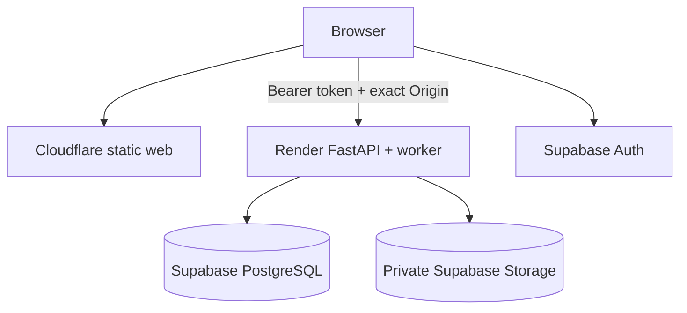
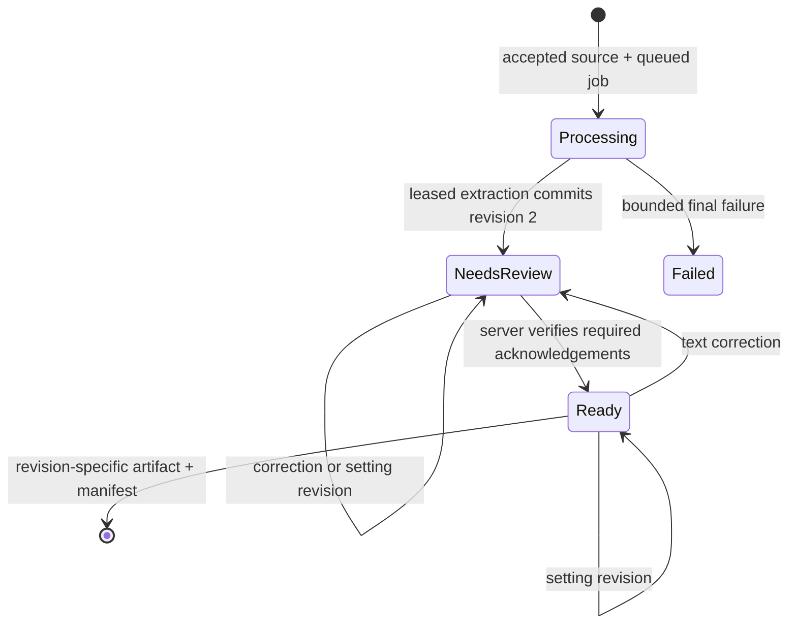

# Architecture

Status: v0.2.0 dual local/hosted baseline  
Last reviewed: 2026-08-03

## Purpose and constraints

Homeworker transforms untrusted PDFs or document images into reviewable, printable A4 notes using a different, licensed handwriting persona. Faithful mode never silently summarizes, invents, or removes text. Every extracted block retains source provenance, confidence, warnings, and review state.

The core remains usable offline without credentials. The public-beta profile must start at $0, keep authoritative data off ephemeral compute, isolate every account, and stop work at application quotas rather than require paid overages.

## Deployment profiles

| Concern | Local profile | Free hosted profile |
|---|---|---|
| Web | Next.js standalone container | Static Next.js export on Cloudflare Pages Free |
| Identity | One implicit local owner | Supabase magic-link session, JWT verified by API |
| Database | SQLite WAL | Supabase Free PostgreSQL |
| Objects | Local generated-key paths | Private Supabase Storage bucket |
| Extraction | Inline bounded call | Durable leased job in the API process |
| Compute | User machine/Docker | One Render Free web service |
| Billing behavior | No external bill | Hard limits; no automatic plan upgrade |



Cloudflare serves application assets only; documents travel directly from the browser to the API. The API is the authorization and policy boundary. Render's filesystem holds bounded temporary work only and can disappear at any time.

## Component responsibilities

| Component | Owns | Does not own |
|---|---|---|
| Web | Sign-in UX, upload/review UI, uncertainty acknowledgements, settings, authenticated blob downloads | Canonical state, access decisions, storage secrets |
| API | Auth enforcement, validation, quotas, owner-scoped lifecycle, artifact integrity, errors | Browser-only trust or implicit text rewriting |
| Worker | Leased extraction, source-digest verification, retry/final failure, retention and deletion-outbox sweeps | User review decisions |
| Extractor | Native text first, OCR fallback, layout, provenance, confidence, warnings | Source mutation or invented content |
| Renderer | Deterministic layout, embedded licensed fonts, exact A4 PDF, typed companions | OCR or semantic rewriting |
| Repository/object store | Immutable revisions, durable jobs, private sources/artifacts, quotas | User-supplied paths or public object URLs |

## Trust and tenancy boundaries

1. Filenames, media declarations, document objects, images, metadata, fonts, and text are attacker-controlled.
2. The browser cannot choose an owner ID, object key, authoritative status, revision, digest, or export identity.
3. Hosted mutations require a valid Supabase token, an exact configured HTTPS `Origin`, and `X-Homeworker-Client: web`.
4. Every project, revision, job, artifact, rate bucket, and object key includes the authenticated owner. Cross-owner probes are indistinguishable from missing IDs.
5. Parsing/OCR has upload, page, pixel, character, artifact, timeout, process, CPU, memory, and temporary-storage ceilings.
6. No optional model/provider is enabled in the hosted free profile; the rules analyzer is deterministic and makes no remote model call.

## Processing flow



Hosted upload streams to a private generated object while hashing and validating size/type. The API then commits the processing project and job atomically. A worker lease verifies the stored source digest before extraction; interruption leaves the durable job reclaimable. Successful extraction creates exactly one new immutable revision.

The server—not browser state—decides whether every uncertain block was corrected or explicitly acknowledged. Rendering accepts an exact historical revision, derives an immutable digest-keyed object key, verifies cached size/SHA-256 on read, and returns an export manifest that binds the source and artifact digests.

## Storage and limits

Local mutable state lives below `/data`; hosted authoritative state lives only in Supabase. Hosted private object keys have this shape:

```text
users/<authenticated-owner>/projects/<project-id>/source.<ext>
users/<authenticated-owner>/projects/<project-id>/revisions/<n>/<kind>-<sha256>.<ext>
```

The hosted defaults allow 10 MiB per upload, 30 PDF pages, 20 active projects, 60 revisions per project, 100 MiB of accounted source/artifact bytes per owner, and 14-day retention. Shared service quotas can be lower operationally; the system rejects new work instead of enabling overage billing.

Deletion removes browser-visible database state transactionally and records private keys in a durable outbox. The worker retries Storage cleanup and retention deletion. A restored external backup still requires operator reconciliation according to the published retention policy.

## Failure and scaling semantics

- Errors have stable codes and request IDs and never include document text, tokens, or object paths.
- A failed upload/extraction/export does not commit an invented or partial document revision.
- Low confidence is a review state, never permission to guess.
- `/health` checks process liveness; `/ready` checks database and private object storage.
- One free Render process owns API and worker duties. Multi-instance scaling requires measured demand, queue/load tests, and a reviewed worker topology; it is not enabled accidentally.
- Free providers may sleep, pause inactive projects, or revise their terms. The documented live-service acceptance test is required before inviting users.
